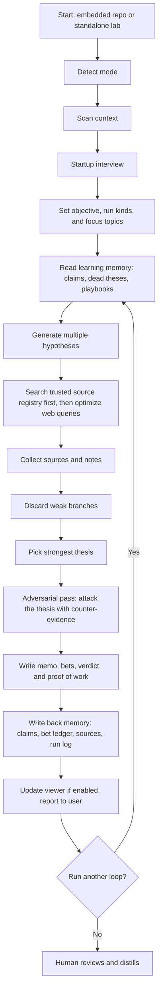

# sia-autoresearch

[](LICENSE)

Source: [github.com/sdrth/sia-autoresearch](https://github.com/sdrth/sia-autoresearch)

## Quickstart

### What it does

Your AI agent runs **structured research loops**: generate hypotheses, search the web, discard weak branches, write a memo and bets, **attack its own thesis with counter-evidence before you ever see it**, score honestly, and log proof of work — while **you** distill what matters. The lab **learns across runs**: a claims ledger of what it believes, a bet ledger that checks whether past calls were right, and a source registry you can grow by hand. One markdown spec drives everything. No new app, CLI, or telemetry.

### Who it's for

**Founders and builders** who want more research loops without outsourcing judgment:

- deciding what to build next from user noise and market signal
- pressure-testing a thesis before a spec, PRD, or roadmap note
- competitive scans, growth experiments, or founder-writing drafts
- keeping research isolated from production code and docs

### Start in 30 seconds

**1.** Open this repo in **Cursor**, **Copilot**, **Claude Code**, **ChatGPT**, or any agent that can read files.

**2.** Copy and paste this prompt:

```
Read and follow: start/AUTORESEARCH-START.md
Then read: AGENTS.md for path rules and hard constraints.

Start sia-autoresearch in this repo. Run the setup interview first (do not skip it), then loop 001. Follow AGENTS.md (static viewer Q10c, audience Q11, compact chat reports). Use web search, in-repo scanning, and subagents when available. Keep all lab artifacts under the lab root; do not modify start/ or examples/ without asking me.
```

**3.** Answer the setup interview when the agent asks — it will propose priorities, run kinds, and gitignore defaults. You confirm or edit. Then loop 001 begins.

### Agent instructions — read these next

Point your agent at these files in order:

| Step | File | What the agent gets |
|------|------|---------------------|
| 1 | [`start/AUTORESEARCH-START.md`](start/AUTORESEARCH-START.md) | **Full spec** — setup interview, run kinds, artifacts, scoring, security, workflows |
| 2 | [`AGENTS.md`](AGENTS.md) | **Agent entry** — path rules, hard constraints, quick prompt, continuous mode |
| 3 | [`start/QUICKLOOP.md`](start/QUICKLOOP.md) | **Condensed loop reference** — the minimum viable loop in one short file; use during runs when context is tight |
| 4 | [`start/schemas/`](start/schemas/) | **Artifact contracts** — JSON Schemas for `manifest.json`, `score.json`, `claims.json` (claims ledger), and `sources.json` (source registry); agents self-validate, no tooling needed |
| 5 | [`.cursor/rules/autoresearch.mdc`](.cursor/rules/autoresearch.mdc) | **Cursor rule** — copy into your repo or use as-is in this lab |
| 6 | [`examples/`](examples/) | **Sample runs** — a 0.76 keep, a 0.72 strategy keep, and a 0.38 **discard** that anchors conservative scoring |

Raw spec URL (works from any repo — your agent can fetch it directly):

`https://raw.githubusercontent.com/sdrth/sia-autoresearch/main/start/AUTORESEARCH-START.md`

Agent entry URL:

`https://raw.githubusercontent.com/sdrth/sia-autoresearch/main/AGENTS.md`

### Using your own product repo instead?

Stay in **Cursor**, **Codex**, **Claude Code**, or whatever agent you already use. Open your product repo and paste this — **no manual file copy required**. The agent can read the spec from the link and bootstrap `autoresearch/` during setup:

```
Read and follow the sia-autoresearch spec:
https://raw.githubusercontent.com/sdrth/sia-autoresearch/main/start/AUTORESEARCH-START.md

Then read agent instructions:
https://raw.githubusercontent.com/sdrth/sia-autoresearch/main/AGENTS.md

Start sia-autoresearch in this repo (embedded mode). Run the setup interview first (do not skip it), then loop 001. Bootstrap autoresearch/ if missing. Follow AGENTS.md. Use web search, in-repo scanning, and subagents when available. All output under autoresearch/ only — never modify files outside it without my approval.
```

Optional — want the spec checked into your repo? The agent can save a copy to `autoresearch/AUTORESEARCH-START.md` during bootstrap, or fetch it yourself:

```bash
mkdir -p autoresearch && curl -sLo autoresearch/AUTORESEARCH-START.md \
  https://raw.githubusercontent.com/sdrth/sia-autoresearch/main/start/AUTORESEARCH-START.md
```

Spec source: [github.com/sdrth/sia-autoresearch](https://github.com/sdrth/sia-autoresearch)

---

## How it works

One file drives everything: [`start/AUTORESEARCH-START.md`](start/AUTORESEARCH-START.md)

Point any AI agent at it and it will:

1. Scan your repo or use the folder as a standalone research workspace
2. Interview you on priorities and what to commit vs ignore
3. Run research loops, score outputs, and optionally build a viewer (your agent chooses the design during setup)

When used inside another repo, everything lives under an `autoresearch/` folder. In this repo (standalone lab), runtime artifacts live at repo root (`config/`, `runs/`, etc.). Nothing outside the lab write zone is modified without your explicit approval.



---

## Repository layout

sia-autoresearch has two layouts. Agents must detect which one applies before reading or writing paths.

| | **Standalone lab (this repo)** | **Embedded (inside your product repo)** |
|---|---|---|
| **Spec** | `start/AUTORESEARCH-START.md` | `autoresearch/AUTORESEARCH-START.md` |
| **Lab root `<lab>/`** | repo root | `autoresearch/` |
| **Config** | `config/` | `autoresearch/config/` |
| **Runs** | `runs/` | `autoresearch/runs/` |
| **Viewer** | static `dashboard/index.html` by default at setup (Q10b/Q10c) | same under `autoresearch/` |
| **Examples** | `examples/` (shipped demos, read-only) | n/a |

---

## Agent shortcuts

Prefer copy-paste? Use the [Quickstart](#quickstart) prompt above. For persistent agent discovery:

### Notes

- **This repo (standalone lab):** point agents at `start/AUTORESEARCH-START.md` — see [`AGENTS.md`](AGENTS.md) and [`.cursor/rules/autoresearch.mdc`](.cursor/rules/autoresearch.mdc)
- **Embedded in your product repo:** paste the block below into your repo's `AGENTS.md`

```markdown
## sia-autoresearch

This repo uses sia-autoresearch. When asked to run research, discover product bets, or explore strategy:

1. Read and follow: `autoresearch/AUTORESEARCH-START.md`
2. All output goes under `autoresearch/` only
3. Never modify files outside `autoresearch/` without explicit human approval
4. Follow AGENTS.md — Q10c static viewer, Q11 audience, compact chat indexes

Full spec: https://github.com/sdrth/sia-autoresearch
```

### Cursor

Add to `.cursor/rules/autoresearch.mdc` (or copy the bundled file from this repo):

```markdown
---
description: sia-autoresearch — founder research system
globs: ["start/**", "config/**", "runs/**", "notes/**", "dashboard/**", "autoresearch/**"]
alwaysApply: false
---

When asked to run sia-autoresearch, do research, generate product bets, or explore strategy:
1. Detect mode (section 2 of the spec): standalone lab uses `start/AUTORESEARCH-START.md` + repo-root paths; embedded uses `autoresearch/AUTORESEARCH-START.md`
2. Create and edit only under `<lab>/` — in standalone lab, `<lab>/` is repo root and `start/` + `examples/` are read-only
3. Follow AGENTS.md — Q10c viewer, Q11 language, compact chat indexes

Spec + source: https://github.com/sdrth/sia-autoresearch

Inspired by https://github.com/karpathy/autoresearch
```

---

## What you get

After bootstrap, the lab produces these artifacts under `<lab>/`:

| Artifact | Standalone lab path | Embedded path | Description |
|----------|---------------------|---------------|-------------|
| Starter spec | `start/AUTORESEARCH-START.md` | `autoresearch/AUTORESEARCH-START.md` | Full agent instructions |
| Config | `config/` | `autoresearch/config/` | Priorities, query seeds, audience profile |
| Source registry | `config/sources/sources.json` | `autoresearch/config/sources/sources.json` | **Your trusted source list** — edit it by hand anytime; agents search it first and grow it every run |
| Living memory | `notes/` | `autoresearch/notes/` | Compounds across runs: narrative, claims ledger, hypothesis index, bets ledger, per-kind playbooks |
| Runs | `runs/` | `autoresearch/runs/` | One folder per loop — hypotheses, notes, memo, **adversarial pass**, bets, verdict |
| Viewer | static `dashboard/index.html` if enabled (Q10b/Q10c) | same under `autoresearch/` | Default is inline HTML; `guided` or `both` add spec + build guide; `skip` omits it. **A local app exists only if you explicitly opt in (Q10d)** — default is filesystem + HTML, no server |
| Publishing queue | `publishing/` | `autoresearch/publishing/` | Human-reviewed drafts ready to promote |

---

## Who is this for?

sia-autoresearch is built for founder-builders who want AI to expand the number of research loops they can run without outsourcing judgment.

The simple idea is: **AI runs more loops; you distill the signal.**

Most tools try to replace thinking with answers. sia-autoresearch is built to help you pressure-test ideas, compare evidence, write memos, and arrive at your own decisions faster.

The agent is expected to search broadly before it synthesizes narrowly. A good run should show proof of work: multiple hypotheses considered, optimized search queries, linked sources, discarded branches, and a clear reason the winning thesis beat the rest.

Scoring is deliberately conservative. High scores are meant to be rare and earned. If an agent has access to stronger models or subagents, it can use them to improve coverage and validation, but the final thesis and score should still reflect one accountable judgment.

It works in two modes:

- **Standalone lab**: clone or fork this repo — spec at `start/`, examples at `examples/`, runtime artifacts at repo root after bootstrap
- **Inside a repo**: copy the spec into `autoresearch/` and keep every research artifact isolated there while reading your product, codebase, docs, and plans as read-only context

---

## Run kinds

| Kind | Use when |
|------|----------|
| `product-bets` | You need sharper product ideas, wedges, or next-step bets |
| `strategy` | You need positioning, sequencing, market framing, or decision support |
| `growth` | You need experiments, channels, messaging, or distribution ideas |
| `competitive-intel` | You need competitor scans, threat mapping, or whitespace analysis |
| `founder-writing` | You need essays, launch notes, drafts, or public thinking |
| `code-research` | You need architecture options, implementation tradeoffs, or technical direction |

### How to run each loop

- `product-bets`: start from one user problem, friction point, or product question and ask for 3-5 concrete bets with evidence and next tests
- `strategy`: start from one decision you need to make and ask for competing theses, tradeoffs, and what would need to be true for each path
- `growth`: start from one acquisition, activation, or retention bottleneck and ask for experiment ideas ranked by likely leverage
- `competitive-intel`: start from one company, category, or workflow and ask for moves, gaps, positioning patterns, and risks
- `founder-writing`: start from one belief, observation, or narrative you want to sharpen and ask for memo-first synthesis before any public draft
- `code-research`: start from one architecture or implementation question and ask for options, constraints, risks, and recommendation criteria

---

## Use cases

- A founder-builder deciding what to build next after reading user feedback, support threads, and market noise
- A solo operator pressure-testing a new thesis before writing a spec, PRD, or roadmap note
- A builder collecting notes, links, and articles in one place and turning them into memos and decisions
- A founder turning recurring internal thinking into essays, launch notes, or founder-writing drafts
- A team lead running targeted competitive scans without mixing raw research into the main repo

---

## Repo isolation guarantee

The agent rule is strict: **everything the lab creates lives under `<lab>/`**. In embedded mode that is `autoresearch/`; in standalone lab mode that is repo root (`config/`, `runs/`, etc.). Shipped reference material (`start/`, `examples/`) stays read-only. The agent reads surrounding repo context read-only and never writes back to canonical files, plans, or code unless you explicitly promote an output.

---

## Security

sia-autoresearch is **spec-first**: markdown instructions and local files. It is not a hosted service and does not ship telemetry.

| | |
|---|---|
| **What runs** | The agent and tools **you already use** (Cursor, Copilot, Claude, etc.) |
| **Web research** | Your agent's **default built-in search** — no custom sia-autoresearch search API |
| **External calls** | None from this repo itself; any network access is whatever your agent does when searching or using tools you enabled |
| **Telemetry** | None — no phone-home, analytics, or usage reporting in the spec or examples |

**You are responsible for security:** agent permissions, MCP servers and subagents you enable, secrets in repo context, gitignore choices, and what you commit or publish. Review run artifacts before sharing. See spec section **2A** for the full trust model.

---

## Examples

See [`examples/`](examples/) for sample runs and **demo viewers**:

- [`runs/2026-05-30-product-bets-001/`](examples/runs/2026-05-30-product-bets-001/) — a good normal run (0.76, `keep`): multi-source, actionable, honest about what's missing — includes an `adversarial.md` where the thesis survives a real counter-evidence attack without gaining score
- [`runs/2026-06-01-strategy-002/`](examples/runs/2026-06-01-strategy-002/) — a strategy run (0.72, `keep`) that compounds on run 001 and kills its strongest-sounding hypothesis with counter-evidence
- [`runs/2026-06-03-competitive-intel-003/`](examples/runs/2026-06-03-competitive-intel-003/) — a **discard** (0.38): real searching, weak sources, obvious thesis — archived cheaply instead of dressed up. This is the calibration anchor for conservative scoring
- [`learning/`](examples/learning/) — self-learning snippets: a bets ledger with a resolved bet and hit rate, and a **write-back meta-review** that mutates weights, claims, and playbooks instead of just commenting
- [`dashboard.html`](examples/dashboard.html) — Notion-style runs viewer with sidebar search/sort/filter and tabbed artifacts (hypotheses, notes, memo, bets, verdict, draft, scores)
- [`reusable-rockets-thesis.html`](examples/reusable-rockets-thesis.html) — single-memo essay-style viewer

These are reference demos only; your agent chooses how to design your lab's viewer during setup (spec section 15).

---

## Contributing

See [CONTRIBUTING.md](CONTRIBUTING.md). One-line version: open an issue or PR against `start/AUTORESEARCH-START.md`.

---

## Credits

Inspired by [Andrej Karpathy's autoresearch](https://github.com/karpathy/autoresearch) — the idea of putting research instructions in a file and letting AI agents run structured loops overnight. sia-autoresearch applies that pattern to founder and builder workflows: product bets, strategy, growth, competitive intel, and writing — not GPU training experiments.

---

## License

MIT — see [LICENSE](LICENSE)
